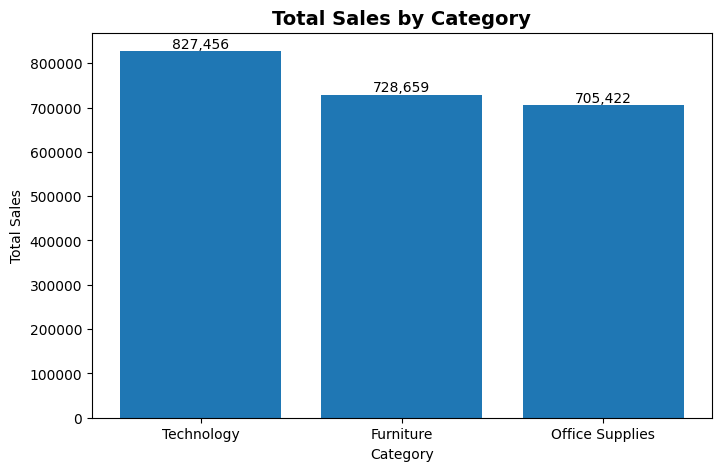
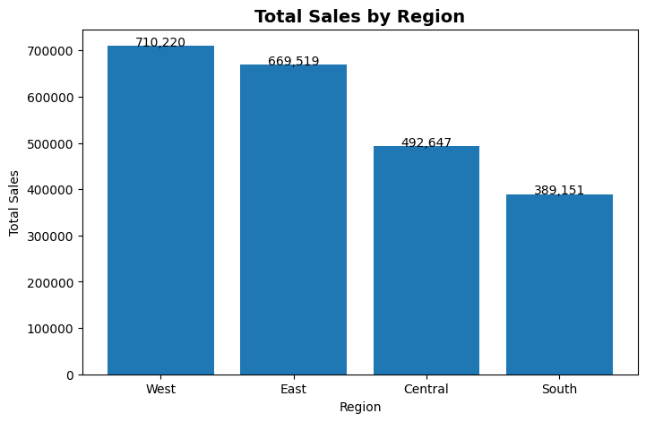
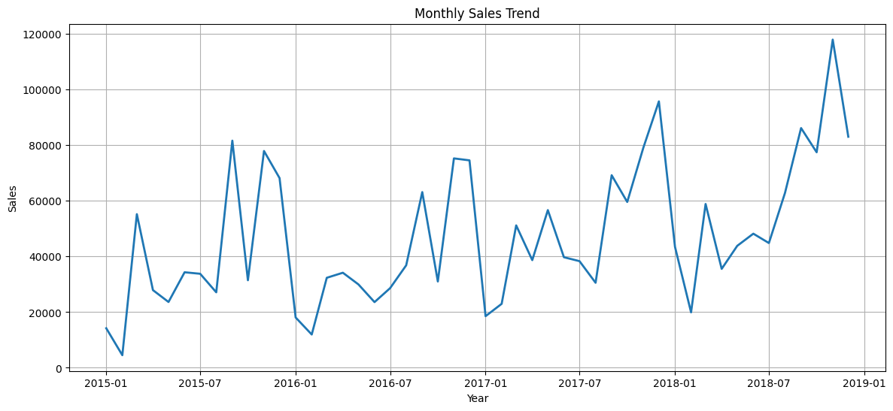
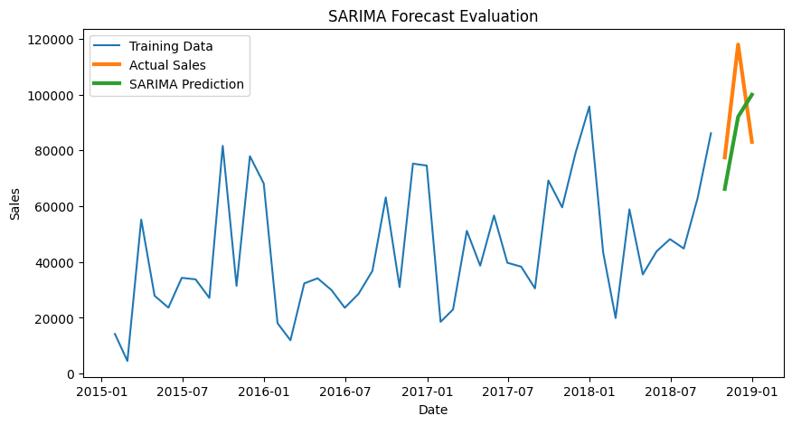
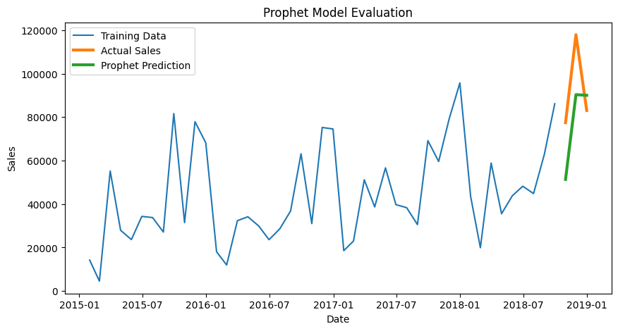
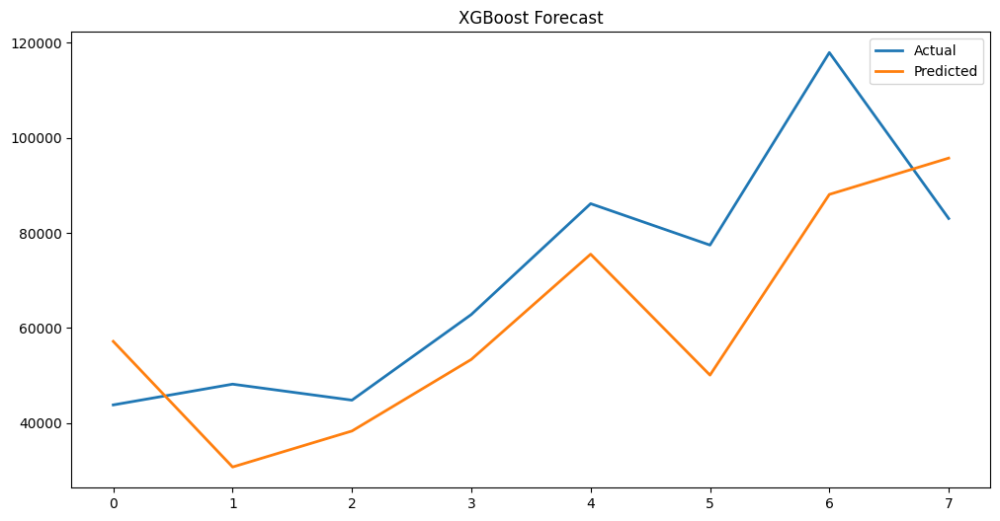
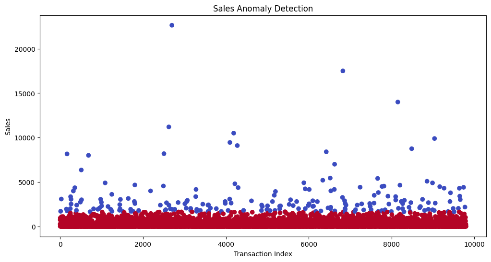
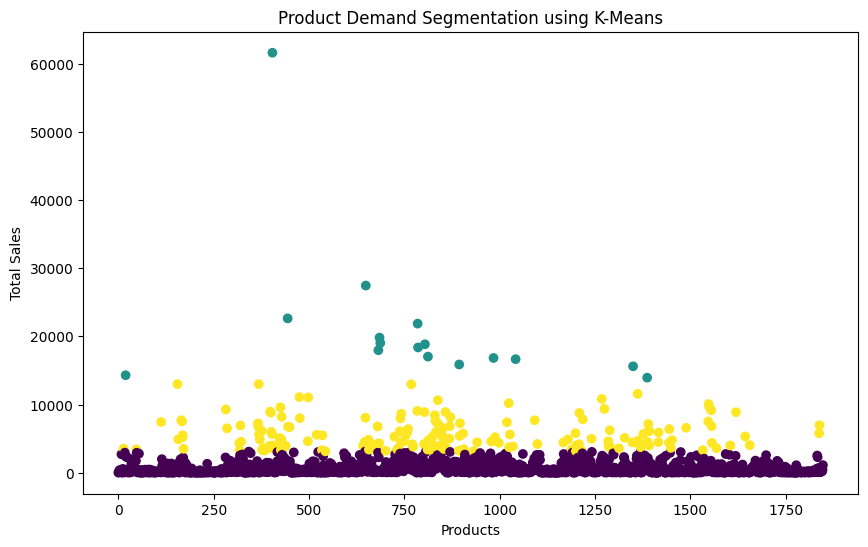

# 📊 Sales Forecasting & Demand Intelligence System

An end-to-end Machine Learning project for analyzing historical retail sales, forecasting future demand, detecting anomalies, and segmenting products using multiple machine learning models.

---

# 🚀 Project Overview

This project analyzes the Superstore Sales Dataset to discover business insights and forecast future sales using different forecasting techniques.

The project includes:

- Data Cleaning & Preprocessing
- Exploratory Data Analysis (EDA)
- Sales Trend Analysis
- Sales Forecasting
- Anomaly Detection
- Product Demand Segmentation
- Interactive Streamlit Dashboard

---

# 🛠️ Tech Stack

- Python
- Pandas
- NumPy
- Matplotlib
- Scikit-Learn
- XGBoost
- Facebook Prophet
- SARIMA
- Streamlit

---

# 📂 Dataset

**Dataset Used:** Superstore Sales Dataset

Records: **9800**

---

# 📈 Visualizations

## 1. Sales by Category



---

## 2. Sales by Region



---

## 3. Monthly Sales Trend



---

## 4. SARIMA Forecast



---

## 5. Prophet Forecast



---

## 6. XGBoost Forecast



---

## 7. Sales Anomaly Detection



---

## 8. Product Demand Segmentation (K-Means)



---

# 🤖 Machine Learning Models Used

- SARIMA
- Facebook Prophet
- XGBoost
- Isolation Forest (Anomaly Detection)
- K-Means Clustering

---

# 📊 Dashboard Features

- KPI Cards
- Region Filter
- Category Filter
- Dataset Preview
- Sales by Category
- Sales by Region
- Monthly Sales Trend
- Forecast Summary
- Project Information

---

# 📁 Project Structure

```
SalesForecasting_AnjuKumari/
│
├── app.py
├── requirements.txt
├── Sales_Forecasting_Analysis.ipynb
├── sales_cleaned.csv
├── train.csv
├── sales_by_category.png
├── sales_by_region.png
├── monthly_sales_trend.png
├── sarima_forecast.png
├── prophet_forecast.png
├── xgboost_prediction.png
├── anomaly_detection.png
├── kmeans_product_segmentation.png
└── README.md
```

---

# ▶️ Run the Project

Install the dependencies

```bash
pip install -r requirements.txt
```

Run Streamlit

```bash
streamlit run app.py
```

---

# 🌐 Live Demo

Streamlit Dashboard:

**https://salesforecasting-anju.streamlit.app/**

---

# 👩‍💻 Developed By

**Anju Kumari**

End-to-End Sales Forecasting & Demand Intelligence System
